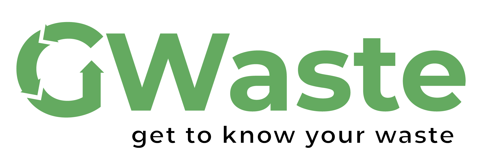

  

<h1 align="center">GWaste</h1>
<h3 align="center">Get to know your Waste</h2>

  
  

  <a href="https://github.com/GWaste/waste-classifer">
      </img>
  </a>
  <a href="https://github.com/GWaste/waste-android">
      </img>
  </a>
  <a href="https://github.com/GWaste/web-app">
      </img>
  </a>

## Background

Waste is the most common problem in society. People sometimes throw the waste away without knowing how to recycle or how dangerous it is. In this pandemic era, most people will use more online shopping than offline. That is, when you buy something physical online, surely it needs good packaging so that the goods you bought arrive safely. Then, after it arrives, you open the package and throw the package away in the trash bin. Imagine that you are not the only one to do it, but millions of people do it.

Not only that, when you have an electronic broken, do you just throw it away, or you recycle it to the responsible party? Did you know that how dangerous throwing electronic wastes into the common landfill?  Most electronics with a battery inside have fire risk if not handled properly. That's why we created this app to help you manage your waste better

Our project is similar with one of Bangkit 2020 project, which is [Garbage Image Classification](https://github.com/fatjan/final-project-DPS1-B). But we have different execution at the end. They will handle all the waste, and then give some incentive to the user. While we will told the user to manage themselves or send it to the responsible party/business. 

## Team Members

|    ID      |        Name              |        Path        |                  Role                      |
| :--------: | :----------------------: | :----------------: | :----------------------------------------: |
|  M0020107  |  Ilham Syahid Syamsudin  |  Machine Learning  | Machine Learning Engineer, Mobile Engineer |
|  M1501716  |  Antony Kurniawan S      |  Machine Learning  | Machine Learning Engineer, Web Engineer    |
|  C1721808  |  Denny Rezky S           |  Cloud Computing   | DevOps Engineer                            |
|  C1071413  |  Defi Oktri Sari         |  Cloud Computing   | DevOps Engineer                            |

## Our Repositories

* [Waste Classifier Notebooks and Datasets](https://github.com/GWaste/waste-classifer)
* [Cloud Logbook](https://github.com/GWaste/cloud-logbook)
* [GWaste Android Application](https://github.com/GWaste/waste-android)
* [GWaste Web Application](https://github.com/GWaste/web-app)
